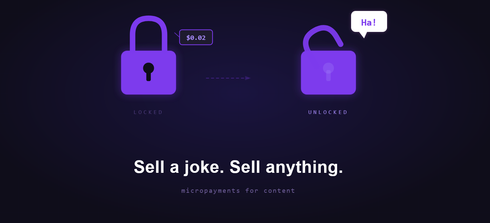

# AnonGuard Gate

> Ever thought you could sell a joke? Now you can.

<p align="center">
  
</p>

Accept Solana payments for any content — a joke, a recipe, a secret, a full course. Two lines of HTML. No backend work for the creator.

## Live demos

- [Blogger](https://anonguard.blogspot.com/2026/03/AnonGuard-Gate-Demo.html)
- [Wix](https://luerasmith.wixsite.com/demoanonguard/post/anonguard-gate-demo)
- [Squarespace](https://cranberry-fiddle-a6cp.squarespace.com/services) — password: `test123`

## Quick start

```html
<div data-anonguard-gate="CONTENT_ID" data-shard="CLIENT_SHARD"></div>
<script src="https://anonguard.io/gate.js"></script>
```

Replace `CONTENT_ID` and `CLIENT_SHARD` with the values from your [AnonGuard dashboard](https://anonguard.io) after publishing gated content.

Try the [live demo](https://anonguardx.github.io/anonguard-gate/demo.html), or see [`demo.html`](demo.html) for the source.

## How it works

1. The widget renders a locked preview card with an "Unlock Content" button.
2. Clicking the button opens a payment modal — QR code, wallet connect, or deep link for mobile.
3. The buyer pays in SOL, USDC, or USDT on Solana.
4. After the payment is confirmed on-chain, the content is decrypted and displayed in place.
5. The unlock is saved locally so returning visitors see the content without paying again.

## Encryption model

Content is encrypted client-side with AES-256-GCM before it leaves the creator's browser. The encryption key is split into two shards using XOR:

- **Server shard** — stored on AnonGuard, encrypted with Shamir's Secret Sharing across multiple keys
- **Client shard** — in the `data-shard` attribute on the creator's page

Neither shard alone decrypts anything. Both are combined inside the buyer's browser only after a verified payment. The server never holds the full key. The creator's page never sees the server shard. No single point of compromise exposes the content.

## On-chain recovery

If a payment goes through but something fails on the server side (network issue, database miss, browser crash), the "Already paid? Connect wallet" option lets the buyer prove wallet ownership. The server cross-references on-chain transactions to recover the purchase.

Buyers don't lose money.

## Platform support

| Platform | Script embed | Iframe embed |
|---|---|---|
| Blogger | Yes | Yes |
| Wix | Yes | Yes |
| Squarespace | Yes | Yes |
| Self-hosted WordPress | Yes | Yes |
| WordPress.com free | No | No |
| Medium | No | No |

The script embed gives a modal experience. The iframe embed works on platforms that allow custom HTML but block external scripts.

## Self-hosting

The widget auto-detects its API origin from the script URL. Point it at your own backend:

```html
<script src="https://your-server.com/gate.js"></script>
```

All API calls go to `your-server.com`. The production build at `anonguard.io/gate.js` has the origin hardcoded for security. This file is the flexible version for self-hosters.

## Files

| File | Description |
|---|---|
| `gate.js` | Full widget source — readable, unminified |
| `demo.html` | Working demo page using a live gated item |
| `images/` | Hero banner and widget screenshots |
| `package.json` | Package metadata |
| `SECURITY.md` | Vulnerability reporting |
| `LICENSE` | MIT |

The production version at `anonguard.io/gate.js` is this code, minified with esbuild and with the API origin locked.

## License

MIT — see [LICENSE](LICENSE).
